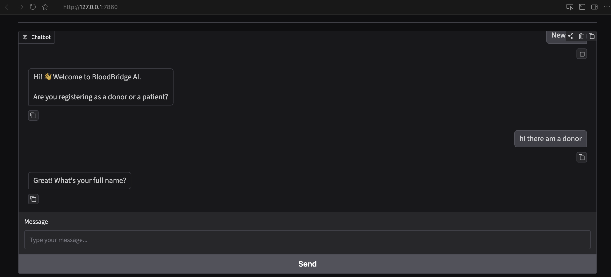
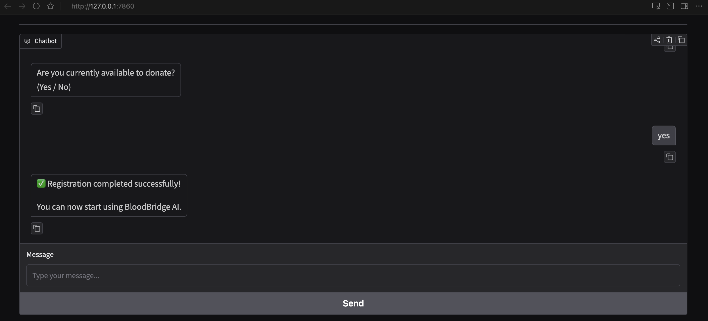
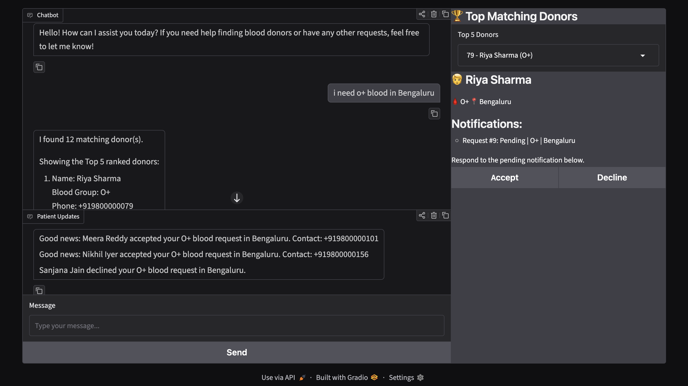

# 🩸 BloodBridge AI

BloodBridge AI is a multi-agent system that connects patients in need of blood with matching, available donors — using a LangGraph agent pipeline, a RAG-based eligibility assistant, and a Gradio chat interface.

## Overview

A patient describes what they need in plain language (e.g. *"I need O+ blood urgently in Bangalore"*), and BloodBridge AI:

1. Classifies the intent of the message (blood request, donor registration, eligibility question, or general chat)
2. Extracts the blood group and location from the message
3. Finds and ranks matching, available donors by blood compatibility, distance, and recency of last donation
4. Notifies the top donors and lets them accept or decline the request
5. Answers eligibility questions (e.g. *"Can I donate after getting a tattoo?"*) using a retrieval-augmented pipeline grounded in donation guidelines and live donor/patient data

## Application Preview

### Donor Registration

<p align="center">
  
</p>

### Registration Completed

<p align="center">
  
</p>

### Blood Request & Donor Matching

<p align="center">
  
</p>

## Architecture

The core is a **LangGraph** state graph coordinating six agents:

| Agent | Responsibility |
|---|---|
| **Router** | Classifies user intent (blood request / registration / eligibility / general chat) via an LLM |
| **Matching** | Extracts the requested blood group and finds compatible, available donors |
| **Ranking** | Ranks matched donors by distance and city match |
| **Eligibility** | Answers donation eligibility questions using RAG over guideline documents and DB records |
| **Notification** | Notifies top-ranked donors of a matching request |
| **Coordinator** | Generates the final natural-language reply and manages donor registration flow |

**RAG pipeline**: Donor/patient records and a blood donation guidelines document are chunked, embedded with Hugging Face sentence-transformers, and stored in a **Chroma** vector store for grounded eligibility answers.

**LLM routing**: Intent classification and reply generation run through **OpenRouter** (`gpt-4.1-mini`), so no direct OpenAI key is required.

## Tech Stack

- **Orchestration**: LangGraph, LangChain
- **UI**: Gradio
- **API layer**: FastAPI
- **LLM**: OpenRouter (GPT-4.1-mini)
- **Vector store**: Chroma + Hugging Face sentence-transformers embeddings
- **Database**: SQLAlchemy (SQLite by default)
- **Package management**: [uv](https://docs.astral.sh/uv/)

## Project Structure

## Getting Started

### Prerequisites
- Python 3.13+
- [uv](https://docs.astral.sh/uv/getting-started/installation/) package manager
- An [OpenRouter](https://openrouter.ai/) API key

### Setup

1. Clone the repository
```bash
   git clone https://github.com/MdSalahuddin008/BloodBridge-AI.git
   cd BloodBridge-AI
```

2. Install dependencies
```bash
   uv sync
```

3. Configure environment variables — copy `.env.example` to `.env` and add your key:
```bash
   cp .env.example .env
```


4. Initialize the database and load sample data
```bash
   uv run python -m app.database.init_db
   uv run python -m app.database.import_data
```

5. Launch the app
```bash
   uv run python -m app.app
```
   This starts the Gradio interface and builds the vector store on launch.

## Evaluation

Donor recommendation quality can be evaluated against the sample datasets:

```bash
uv run python evaluate_donor_recommendations.py
```

## Disclaimer

BloodBridge AI is a portfolio/demo project. `donors.json` and `patients.json` contain synthetic sample data only, and the eligibility guidance provided by the assistant is not a substitute for professional medical advice.

## Author

Built by [MdSalahuddin008](https://github.com/MdSalahuddin008)
